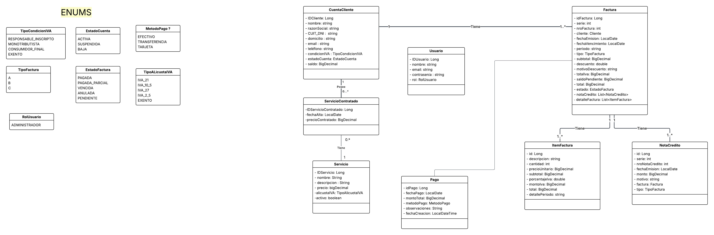
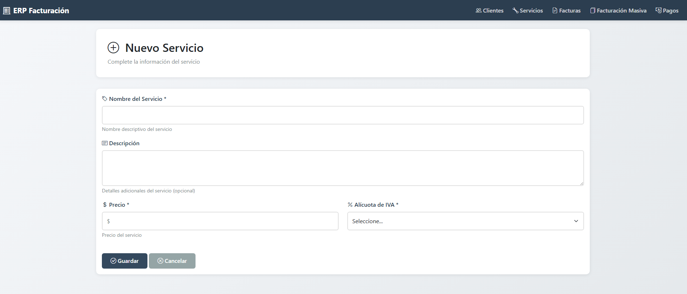
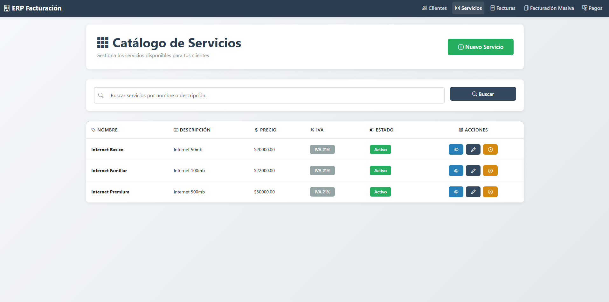

# Diseño y Planificación - Iteración 1

## Trabajo en equipo

Durante esta primera iteración, el equipo se distribuyó las historias de usuario según sus fortalezas y conocimientos previos. A continuación se detalla el trabajo realizado por cada integrante:

**Axel Dos Santos:**
- Implementó la **HU-01: Alta de cliente**, incluyendo el modelo de datos `CuentaCliente` con validaciones Bean Validation completas, el controlador con manejo de errores, el servicio con lógica de negocio y las vistas Thymeleaf.
- Implementó la **HU-21: Asignar servicio a un cliente**, desarrollando el modelo rico con métodos de negocio en `CuentaCliente`, la relación bidireccional con `ServicioContratado`, endpoints en el controlador y las vistas para asignación y consulta de histórico.
- Colaboró en la configuración inicial del proyecto Spring Boot 

**Leandro Escalada:**
- Implementó la **HU-16: Alta de servicio**, creando el modelo `Servicio` con validaciones y métodos de cálculo de IVA.
- Implementó la **HU-17: Listado de servicio**, desarrollando el repositorio con consultas personalizadas y la vista de lista con búsqueda.

**Gabriel Mittelstedt:**
- Implementó la **HU-04: Emisión de factura individual**, aplicando el patrón RICO con lógica de negocio en las entidades `Factura` e `ItemFactura`. Desarrolló la generación automática de ítems desde servicios contratados, el sistema de numeración correlativa por serie, y la determinación automática del tipo de factura según reglas AFIP.
- Implementó la **HU-06: Consulta de factura individual**, creando las vistas de listado con filtros y detalle completo con cálculos de subtotales, IVA, descuentos y saldo pendiente.
- Integró el módulo de facturación con los servicios contratados del cliente desarrollados por Axel Dos Santos.

**Marcos Daubermann:**
- Implementó la **HU-07: Emisión de facturación masiva por período** (trabajo en progreso).
- Implementó la **HU-10: Listado y búsqueda de facturas** (trabajo en progreso).

**Axel Limberger:**

- Implementó la **HU-11: Registrar pago total de factura** (trabajo en progreso).
- Implementó la **HU-12: Registrar pago parcial de factura** (trabajo en progreso).

**Tareas compartidas del equipo:**
- Definición de la arquitectura MVC del proyecto
- Establecimiento de convenciones de código y nomenclatura
- Configuración del repositorio Git y estrategia de branches
- Documentación JavaDoc en todas las clases del modelo

---

## Diseño OO

(Insertar DC de la primera iteración)
---

## Wireframe y Casos de Uso

### Wireframe: Alta de Cliente

**Vista: formulario.html**

**Caso de Uso: Alta de Cliente**

| Elemento | Descripción |
|----------|-------------|
| **Actor** | Administrador |
| **Precondición** | El administrador ha iniciado sesión y accedió a la sección de clientes |
| **Flujo Principal** | 1. El administrador hace clic en "Nuevo Cliente" 2. El sistema muestra el formulario de alta 3. El administrador completa los campos obligatorios (nombre, razón social, CUIT/DNI, domicilio, email, condición IVA, estado) 4. El administrador opcionalmente ingresa el teléfono 5. El administrador hace clic en "Guardar Cliente" 6. El sistema valida el formato del CUIT/DNI (7-11 dígitos) 7. El sistema valida que el CUIT/DNI no exista en la base de datos 8. El sistema valida el formato del email 9. El sistema guarda el cliente con estado inicial ACTIVA y saldo en 0.00 10. El sistema muestra mensaje de éxito y redirige al listado de clientes |
| **Flujos Alternativos** | **4a.** Si hay errores de validación (campo vacío, formato inválido): &nbsp;&nbsp;1. El sistema muestra los errores debajo de cada campo afectado &nbsp;&nbsp;2. El formulario conserva los datos ingresados &nbsp;&nbsp;3. Vuelve al paso 3  **7a.** Si el CUIT/DNI ya existe: &nbsp;&nbsp;1. El sistema muestra error "Ya existe un cliente con el CUIT/DNI: XXXXXXX" &nbsp;&nbsp;2. Vuelve al paso 3 |
| **Postcondición** | Se crea un nuevo cliente con estado ACTIVA y saldo inicial 0.00 |

---

### Wireframe: Detalle de Cliente y Asignación de Servicios

**Vista: detalle.html**

**Vista: agregar-servicio.html**

**Vista: historico-servicios.html**

**Caso de Uso: Asignar Servicio a un Cliente**

| Elemento | Descripción |
|----------|-------------|
| **Actor** | Administrador |
| **Precondición** | El cliente existe en el sistema con estado ACTIVA Existen servicios creados y activos en el sistema |
| **Flujo Principal** | 1. El administrador accede al detalle del cliente 2. El administrador hace clic en "Asignar Servicio" 3. El sistema muestra una lista de servicios activos que el cliente NO tiene contratados 4. El administrador selecciona un servicio y hace clic en "Asignar" 5. El sistema registra la contratación con: &nbsp;&nbsp;- Fecha actual (LocalDate.now()) &nbsp;&nbsp;- Precio actual del servicio &nbsp;&nbsp;- Estado activo = true 6. El sistema valida que el servicio no esté ya contratado activamente 7. El sistema persiste la relación ServicioContratado 8. El sistema muestra mensaje de éxito "Servicio asignado exitosamente" 9. El sistema redirige al detalle del cliente |
| **Flujos Alternativos** | **6a.** Si el servicio ya está contratado activamente: &nbsp;&nbsp;1. El sistema muestra error "El servicio 'X' ya está contratado para este cliente" &nbsp;&nbsp;2. Vuelve al paso 3  **3a.** Si no hay servicios disponibles: &nbsp;&nbsp;1. El sistema muestra mensaje "No hay servicios disponibles para asignar" &nbsp;&nbsp;2. Muestra botón para volver al detalle |
| **Postcondición** | El servicio queda vinculado al cliente con precio histórico y fecha registrada |

**Caso de Uso: Ver Histórico de Servicios del Cliente**

| Elemento | Descripción |
|----------|-------------|
| **Actor** | Administrador |
| **Precondición** | El cliente existe en el sistema |
| **Flujo Principal** | 1. El administrador accede al detalle del cliente 2. El administrador hace clic en "Ver Histórico" 3. El sistema muestra una tabla con TODOS los servicios contratados (activos e inactivos) 4. Para cada servicio se visualiza: nombre, descripción, fecha de alta, precio contratado, alícuota IVA, total con IVA y estado (Activo/Inactivo) 5. El sistema muestra un resumen con contadores: servicios activos, inactivos y total 6. El administrador puede volver al detalle del cliente |
| **Flujos Alternativos** | **3a.** Si el cliente no tiene servicios contratados: &nbsp;&nbsp;1. El sistema muestra mensaje "No hay servicios contratados" &nbsp;&nbsp;2. Muestra botón para asignar el primer servicio |
| **Postcondición** | El administrador visualiza el histórico completo sin modificar datos |

---

### Wireframe: Alta de Servicio (HU-16)

**Vista: formulario.html**

**Caso de Uso: Alta de Servicio (HU-16)**

| Elemento | Descripción |
|----------|-------------|
| **Actor** | Administrador |
| **Precondición** | El administrador ha iniciado sesión y accedió a la sección de servicios |
| **Flujo Principal** | 1. El administrador hace clic en "Nuevo Servicio" 2. El sistema muestra el formulario con campos: nombre, descripción (opcional), precio, alícuota IVA y estado 3. El administrador completa los campos obligatorios (nombre, precio, alícuota IVA) 4. El administrador opcionalmente ingresa la descripción 5. El sistema marca por defecto el estado como "Activo" 6. El administrador hace clic en "Crear Servicio" 7. El sistema verifica que los datos ingresados sean validos 8. El sistema verifica que no exista otro servicio con el mismo nombre 9. El sistema persiste el servicio  10. El sistema muestra mensaje "Servicio '[Nombre]' creado exitosamente" 11. El sistema redirige al listado de servicios |
| **Flujos Alternativos** | **7a.** Si el nombre está vacío: &nbsp;&nbsp;1. El sistema muestra una ventana de error con el mensaje ("El nombre del servicio es obligatorio") &nbsp;&nbsp;2. Vuelve al paso 3  **7b.** Si el precio no es mayor a cero: &nbsp;&nbsp;1. El sistema muestra una ventana de error con el mensaje ("El precio debe ser mayor a cero") &nbsp;&nbsp;;2. Vuelve al paso 3  **7c.** Si no se seleccionó alícuota IVA: &nbsp;&nbsp;1. El sistema muestra una ventana de error con el mensaje ("La alícuota de IVA es obligatoria") &nbsp;&nbsp;2. Vuelve al paso 3  **8a.** Si el nombre ya existe: &nbsp;&nbsp;1. El sistema muestra una ventana de error con el mensaje  ("Ya existe un servicio con el nombre: [Nombre]")` &nbsp;&nbsp;2. Vuelve al paso 3 |
| **Postcondición** | Se crea un nuevo servicio activo con: - Métodos de cálculo de IVA disponibles - Precio histórico para contratos futuros - Disponible para asignar a clientes |

---

### Wireframe: Listado de Servicios (HU-17)

**Vista: lista.html**

**Caso de Uso: Listado de Servicios (HU-17)**

| Elemento | Descripción |
|----------|-------------|
| **Actor** | Administrador |
| **Precondición** | El administrador ha iniciado sesión |
| **Flujo Principal** | 1. El administrador accede a la sección "Servicios" 2. El sistema muestra una tabla con todos los servicios: &nbsp;&nbsp;- Nombre &nbsp;&nbsp;- Descripción &nbsp;&nbsp;- Precio &nbsp;&nbsp;- Alícuota IVA (porcentaje) &nbsp;&nbsp;- Estado representado con colores (verde=Activo, gris=Inactivo) &nbsp;&nbsp;- Botones de acción: "Ver" y "Editar" 3. El sistema muestra contador de totales y activos/inactivos 4. El administrador puede hacer clic en "Ver" para ver detalles 5. El administrador puede hacer clic en "Editar" para modificar |
| **Flujos Alternativos** | **3a.** Búsqueda por nombre o descripción: &nbsp;&nbsp;1. El administrador ingresa un término en el campo "Buscar" &nbsp;&nbsp;2. El administrador hace clic en "Buscar" &nbsp;&nbsp;3. El sistema filtra servicios (sin distinguir mayúsculas/minúsculas) &nbsp;&nbsp;4. El sistema muestra solo resultados coincidentes &nbsp;&nbsp;5. El sistema muestra el término buscado para referencia &nbsp;&nbsp;6. El administrador puede hacer clic en "Limpiar" para ver todos nuevamente  **2a.** Si no hay servicios registrados: &nbsp;&nbsp;1. El sistema muestra mensaje "No hay servicios registrados" &nbsp;&nbsp;2. Muestra botón destacado "Crear primer servicio" &nbsp;&nbsp;3. Fin del caso de uso  **3b.** Si la búsqueda no devuelve resultados: &nbsp;&nbsp;1. El sistema muestra mensaje "No se encontraron servicios con '[término]'" &nbsp;&nbsp;2. Muestra botón "Limpiar búsqueda" &nbsp;&nbsp;3. Mantiene el formulario de búsqueda visible |
| **Postcondición** | El administrador visualiza el listado completo o filtrado de servicios sin modificar datos |

---

### Wireframe: Emisión y Consulta de Factura Individual

**Vista: formulario-individual.html (HU-04)**

**Vista: lista.html (HU-06)**

**Vista: detalle.html (HU-06)**

### Wireframe: Pago de Factura total y Parcial

**Vista: formulario-total (HU-11)**

 

**Vista: formulario-parcial (HU-12)** 

 

**Caso de Uso: Emisión de Factura Individual (HU-04)**

| Elemento | Descripción |
|----------|-------------|
| **Actor** | Administrador |
| **Precondición** | El cliente existe en el sistema con estado ACTIVA El cliente tiene al menos un servicio contratado activo El emisor tiene condición IVA configurada como Responsable Inscripto |
| **Flujo Principal** | 1. El administrador accede a "Nueva Factura Individual" 2. El sistema muestra el formulario con la lista de clientes activos 3. El administrador selecciona un cliente del desplegable 4. El administrador ingresa el período (texto libre, ej: "Noviembre 2025") 5. El administrador selecciona la fecha de emisión (por defecto fecha actual) 6. El administrador selecciona la fecha de vencimiento 7. El administrador opcionalmente ingresa porcentaje de descuento (0-100%) y motivo 8. El administrador hace clic en "Emitir Factura" 9. El sistema obtiene todos los servicios contratados activos del cliente 10. El sistema crea automáticamente un ítem por cada servicio con: descripción, precio contratado, cantidad=1, alícuota IVA del servicio 11. El sistema determina el tipo de factura aplicando reglas AFIP: &nbsp;&nbsp;- RI (emisor) + RI (cliente) = Factura A &nbsp;&nbsp;- RI (emisor) + CF (cliente) = Factura B &nbsp;&nbsp;- CF (emisor) + CF (cliente) = Factura C 12. El sistema asigna serie según tipo (A→1, B→2, C→3) 13. El sistema obtiene el siguiente número correlativo para esa serie 14. Cada ítem calcula su subtotal, IVA y total 15. La factura calcula totales: subtotal, total IVA, descuento, total general 16. El sistema establece estado inicial PENDIENTE y saldo pendiente igual al total 17. El sistema persiste la factura con todos sus ítems 18. El sistema muestra mensaje de éxito con datos de la factura generada 19. El sistema redirige al detalle de la factura creada |
| **Flujos Alternativos** | **9a.** Si el cliente no tiene servicios contratados activos: &nbsp;&nbsp;1. El sistema muestra error "El cliente no tiene servicios activos para facturar" &nbsp;&nbsp;2. Vuelve al paso 2  **7a.** Si se ingresa descuento sin motivo: &nbsp;&nbsp;1. El sistema muestra error "Debe indicar el motivo del descuento" &nbsp;&nbsp;2. Vuelve al paso 7  **7b.** Si el descuento es inválido (menor a 0 o mayor a 100): &nbsp;&nbsp;1. El sistema muestra error "El descuento debe estar entre 0% y 100%" &nbsp;&nbsp;2. Vuelve al paso 7  **6a.** Si la fecha de vencimiento es anterior a la fecha de emisión: &nbsp;&nbsp;1. El sistema muestra error "La fecha de vencimiento debe ser posterior a la fecha de emisión" &nbsp;&nbsp;2. Vuelve al paso 6 |
| **Postcondición** | Se crea una factura individual con: - Tipo, serie y número asignados automáticamente - Ítems generados desde servicios contratados - Estado PENDIENTE - Totales calculados correctamente - Saldo pendiente igual al total |

---

**Caso de Uso: Consulta de Factura Individual (HU-06)**

| Elemento | Descripción |
|----------|-------------|
| **Actor** | Administrador |
| **Precondición** | Existen facturas registradas en el sistema |
| **Flujo Principal** | 1. El administrador accede a "Gestión de Facturas" 2. El sistema muestra el listado de todas las facturas con: &nbsp;&nbsp;- Serie y número de factura &nbsp;&nbsp;- Tipo (badge con color) &nbsp;&nbsp;- Cliente (nombre) &nbsp;&nbsp;- Período (badge) &nbsp;&nbsp;- Fecha de emisión &nbsp;&nbsp;- Fecha de vencimiento &nbsp;&nbsp;- Total formateado &nbsp;&nbsp;- Estado (badge con colores: verde=Pagada, amarillo=Pendiente, rojo=Vencida, azul=Parcialmente Pagada, gris=Anulada) 3. El administrador opcionalmente aplica filtros: &nbsp;&nbsp;- Por estado (desplegable) &nbsp;&nbsp;- Por tipo de factura (desplegable) &nbsp;&nbsp;- Por período (texto libre) 4. El administrador hace clic en "Ver Detalle" de una factura 5. El sistema muestra la vista completa con: &nbsp;&nbsp;**Cabecera:** Tipo, serie y número de factura &nbsp;&nbsp;**Datos del cliente:** nombre, CUIT/DNI, condición IVA, domicilio &nbsp;&nbsp;**Datos de factura:** período, fechas, estado &nbsp;&nbsp;**Tabla de ítems:** descripción, cantidad, precio unitario, subtotal, alícuota IVA, monto IVA, total por ítem &nbsp;&nbsp;**Totales:** subtotal general, total IVA, descuento aplicado, total general, saldo pendiente 6. El sistema muestra botones de acción según el estado: &nbsp;&nbsp;- Si estado=PENDIENTE y saldo>0: botones "Registrar Pago" y "Anular Factura" &nbsp;&nbsp;- Si estado=PAGADA_PARCIALMENTE: botón "Registrar Pago" &nbsp;&nbsp;- Si estado=PAGADA_TOTALMENTE o ANULADA: sin acciones 7. El administrador puede volver al listado |
| **Flujos Alternativos** | **2a.** Si no existen facturas en el sistema: &nbsp;&nbsp;1. El sistema muestra mensaje "No hay facturas registradas" &nbsp;&nbsp;2. Muestra botón para crear la primera factura  **3a.** Si los filtros no devuelven resultados: &nbsp;&nbsp;1. El sistema muestra mensaje "No se encontraron facturas con los criterios especificados" &nbsp;&nbsp;2. Muestra botón para limpiar filtros |
| **Postcondición** | El administrador visualiza la información completa de la factura sin modificar datos |

---

## Backlog de Iteración 1

Las siguientes historias de usuario fueron seleccionadas para implementarse en esta iteración:

1. **HU-01:** Alta de cliente - *Responsable: Axel Dos Santos*
2. **HU-16:** Alta de servicio - *Responsable: Leandro Escalada*
3. **HU-17:** Listado de servicio - *Responsable: Leandro Escalada*
4. **HU-21:** Asignar servicio a un cliente - *Responsable: Axel Dos Santos*
5. **HU-04:** Emisión de factura individual - *Responsable: Gabriel Mittelstedt*
6. **HU-07:** Emisión de facturación masiva por período - *Responsable: Marcos Douberman*
7. **HU-06:** Consulta de factura individual - *Responsable: Gabriel Mittelstedt*
8. **HU-10:** Listado y búsqueda de facturas - *Responsable: Marcos Douberman*
9. **HU-11:** Registrar pago total de factura - *Responsable: Axel Limberger*
10. **HU-12:** Registrar pago parcial de factura - *Responsable: Axel Limberger* 

---

## Tareas

### Tareas para HU-01: Alta de Cliente

**Análisis y Diseño:**
- [x] Analizar requisitos de la historia de usuario
- [x] Identificar validaciones necesarias (CUIT/DNI, email, campos obligatorios)
- [x] Definir modelo de datos con atributos y restricciones
- [x] Diseñar enumeraciones (TipoCondicionIVA, EstadoCuenta)

**Modelo (Entidades):**
- [x] Crear clase `CuentaCliente` con anotaciones JPA
- [x] Agregar validaciones Bean Validation (@NotBlank, @Email, @Pattern)
- [x] Documentar con JavaDoc todos los campos y métodos
- [x] Implementar método `@PrePersist` para valores por defecto (estado ACTIVA, saldo 0.00)
- [x] Crear enum `TipoCondicionIVA` con valores según AFIP
- [x] Crear enum `EstadoCuenta` (ACTIVA, SUSPENDIDA, BAJA)

**Repositorio:**
- [x] Crear interfaz `CuentaClienteRepositorie` extendiendo JpaRepository
- [x] Agregar método personalizado `existsByCuitDni(String cuitDni)`

**Servicio:**
- [x] Crear clase `CuentaClienteService` con anotación @Service
- [x] Implementar método `crearCliente(CuentaCliente cliente)` con validación de duplicados
- [x] Implementar método `obtenerTodosLosClientes()` con @Transactional(readOnly=true)

**Controlador:**
- [x] Crear clase `CuentaClienteController` con @RequestMapping("/clientes")
- [x] Implementar endpoint GET `/clientes` para listar clientes
- [x] Implementar endpoint GET `/clientes/nuevo` para mostrar formulario
- [x] Implementar endpoint POST `/clientes/nuevo` con @Valid y BindingResult

**Vista (Templates Thymeleaf):**
- [x] Crear `formulario.html` con campos del cliente

---

### Tareas para HU-21: Asignar Servicio a un Cliente

**Análisis y Diseño:**
- [x] Analizar requisitos de asignación de servicios
- [x] Planificar flujo de asignación y validación de duplicados

**Modelo (Entidades):**
- [x] Crear relación @OneToMany en `CuentaCliente` hacia `ServicioContratado`
- [x] Implementar método rico `contratarServicio(Servicio)` en `CuentaCliente`
  - Validar duplicados con `tieneServicioContratadoActivo()`
  - Registrar fecha actual con `LocalDate.now()`
  - Copiar precio actual del servicio
- [x] Implementar método `tieneServicioContratadoActivo(Servicio)` 
- [x] Implementar método `getServiciosContratadosActivos()`
- [x] Agregar método sobrecargado `calcularPrecioConIva(BigDecimal)` en `Servicio`

**Servicio:**
- [x] Implementar método `obtenerClientePorId(Long id)` en `CuentaClienteService`
- [x] Implementar método `asignarServicio(Long clienteId, Long servicioId)`

**Controlador:**
- [x] Implementar endpoint GET `/clientes/{id}` para ver detalle del cliente
- [x] Implementar endpoint GET `/clientes/{id}/servicios/asignar` 
- [x] Implementar endpoint POST `/clientes/{clienteId}/servicios/{servicioId}/asignar`
- [x] Implementar endpoint GET `/clientes/{id}/servicios/historico`

**Vista (Templates Thymeleaf):**
- [x] Crear `agregar-servicio.html`:
- [x] Crear `historico-servicios.html`:

---

### Tareas para HU-16: Alta de Servicio

**Análisis y Diseño:**
- [x] Analizar requisitos de la historia de usuario
- [x] Identificar validaciones necesarias (nombre único, precio positivo, alícuota IVA obligatoria)
- [x] Definir modelo de datos con atributos y restricciones JPA
- [x] Diseñar enumeración `TipoAlicuotaIVA` con valores según AFIP

**Modelo (Entidades):**
- [x] Crear clase `Servicio` con anotaciones JPA:
  - `@Entity`, `@Data` (Lombok)
  - `@Id` + `@GeneratedValue(strategy = IDENTITY)` para `IDServicio`
- [x] Agregar campo `nombre` con `@Column(nullable=false, unique=true)`
- [x] Agregar campo `descripcion` opcional (sin restricciones)
- [x] Agregar campo `precio` con `@Column(nullable=false, precision=10, scale=2)`
- [x] Agregar campo `alicuotaIVA` con `@Enumerated(EnumType.STRING)` y `@Column(nullable=false)`
- [x] Agregar campo `activo` con valor por defecto `true`
- [x] Agregar relación `@OneToMany(mappedBy="servicio")` hacia `ServicioContratado`
- [x] Implementar método rico `validar()` con lógica de validación:
  - Nombre no vacío
  - Precio > 0
  - Alícuota IVA no nula
- [x] Implementar método `calcularIva()` que:
  - Obtiene porcentaje según enum (21%, 10.5%, 27%, 2.5%, 0%)
  - Calcula: `precio * porcentaje / 100`
  - Usa `RoundingMode.HALF_UP` con 2 decimales
- [x] Implementar método `calcularPrecioConIva()` que retorna `precio + calcularIva()`
- [x] Implementar método sobrecargado `calcularPrecioConIva(BigDecimal precioBase)` para precios históricos
- [x] Implementar métodos `activar()` y `desactivar()` para gestión de estado
- [x] Documentar con JavaDoc todos los campos y métodos públicos

**Enumeraciones:**
- [x] Crear enum `TipoAlicuotaIVA` en paquete `model.enums` con valores:
  - `IVA_21` → 21%
  - `IVA_10_5` → 10.5%
  - `IVA_27` → 27%
  - `IVA_2_5` → 2.5%
  - `EXENTO` → 0%
- [x] Agregar método `getPorcentaje()` o descripción para cada valor
- [x] Documentar cada constante con su uso según normativa AFIP

**Repositorio:**
- [x] Crear interfaz `ServicioRepository` en paquete `repositories`
- [x] Extender `JpaRepository<Servicio, Long>`
- [x] Agregar método `Optional<Servicio> findByNombre(String nombre)` para verificar duplicados
- [x] Agregar método `List<Servicio> findByActivoTrue()` para listar solo activos
- [x] Agregar método de búsqueda:
  - `List<Servicio> findByNombreContainingIgnoreCaseOrDescripcionContainingIgnoreCase(String nombre, String descripcion)`
- [x] Anotar con `@Repository`

**Servicio:**
- [x] Crear clase `ServicioService` en paquete `services`
- [x] Anotar con `@Service`
- [x] Inyectar `ServicioRepository` con `@Autowired`
- [x] Implementar método `crearServicio(Servicio servicio)`:
  - Anotar con `@Transactional`
  - Llamar a `servicio.validar()` (delega al modelo rico)
  - Verificar nombre duplicado: `if (repository.findByNombre().isPresent())`
  - Lanzar `IllegalArgumentException` si existe
  - Persistir con `repository.save(servicio)`
  - Retornar servicio guardado
- [x] Implementar método `listarTodos()` que retorna `repository.findAll()`
- [x] Implementar método `listarActivos()` que retorna `repository.findByActivoTrue()`
- [x] Implementar método `buscarPorId(Long id)`:
  - Usar `repository.findById(id).orElseThrow()`
  - Lanzar `IllegalArgumentException` con mensaje descriptivo si no existe
- [x] Implementar método `buscar(String termino)`:
  - Llamar al query method del repositorio
  - Pasar el mismo término para nombre y descripción
- [x] Documentar con JavaDoc todos los métodos públicos

**Controlador:**
- [x] Crear clase `ServicioController` en paquete `controllers`
- [x] Anotar con `@Controller` y `@RequestMapping("/servicios")`
- [x] Inyectar `ServicioService` con `@Autowired`
- [x] Implementar endpoint GET `/servicios/nuevo`:
  - Anotar con `@GetMapping("/nuevo")`
  - Agregar `new Servicio()` al modelo
  - Agregar `TipoAlicuotaIVA.values()` al modelo para el select
  - Agregar atributo `"accion"` = `"Crear"` para el título del formulario
  - Retornar vista `"servicios/formulario"`
- [x] Implementar endpoint POST `/servicios/nuevo`:
  - Anotar con `@PostMapping("/nuevo")`
  - Recibir `@ModelAttribute Servicio servicio`
  - Usar `RedirectAttributes` para mensajes flash
  - Try-catch para capturar `IllegalArgumentException`
  - En éxito:
    - Llamar a `servicioService.crearServicio(servicio)`
    - Agregar mensaje: `"Servicio '" + nombre + "' creado exitosamente"`
    - Agregar `"tipoMensaje"` = `"success"` para CSS
    - Redirigir a `"redirect:/servicios"`
  - En error:
    - Agregar mensaje de error
    - Agregar `"tipoMensaje"` = `"danger"`
    - Redirigir a `"redirect:/servicios/nuevo"`
- [x] Documentar con JavaDoc incluyendo descripción de HU-16

**Vista (Templates Thymeleaf):**
- [x] Crear `servicios/formulario.html` con:
  - Formulario con `th:action` dinámico (usa atributo "accion")
  - Campo nombre: `<input th:field="*{nombre}" type="text" required>`
  - Campo descripción: `<textarea th:field="*{descripcion}">`
  - Campo precio: `<input th:field="*{precio}" type="number" step="0.01" min="0.01" required>`
  - Select de alícuotas: `<select th:field="*{alicuotaIVA}" required>`
    - Iterar con `th:each="alicuota : ${alicuotas}"`
    - Usar `th:value="${alicuota}"` y `th:text` para descripción
  - Checkbox activo: `<input th:field="*{activo}" type="checkbox">`
  - Botón "Cancelar" que vuelve a `/servicios`
  - Botón submit con texto dinámico según `${accion}`
  - Div para mostrar mensajes de error con `th:if="${error}"`
  - Incluir `<input type="hidden" th:name="${_csrf.parameterName}" th:value="${_csrf.token}"/>`
  - Aplicar clases CSS/Bootstrap para diseño responsive
  - Validaciones HTML5 (required, min, step)

**Testing:**
- [ ] Crear test unitario `ServicioTest.java`:
  - Probar `validar()` con nombre vacío (debe lanzar excepción)
  - Probar `validar()` con precio cero o negativo
  - Probar `validar()` con alícuota IVA nula
  - Probar `calcularIva()` con cada tipo de alícuota
  - Probar `calcularPrecioConIva()` con diferentes precios
- [ ] Crear test de integración `ServicioServiceTest.java`:
  - Probar `crearServicio()` exitoso
  - Probar `crearServicio()` con nombre duplicado (debe lanzar excepción)
  - Verificar que se persiste correctamente en BD H2
- [ ] Crear test de controlador `ServicioControllerTest.java`:
  - Probar POST `/servicios/nuevo` con datos válidos (debe redirigir con mensaje)
  - Probar POST con nombre duplicado (debe mostrar error)
  - Verificar manejo de excepciones

---

### Tareas para HU-17: Listado de Servicios

**Análisis y Diseño:**
- [x] Analizar requisitos de listado y búsqueda
- [x] Planificar flujo de búsqueda por nombre/descripción (case-insensitive)
- [x] Definir formato de visualización en tabla con badges de estado

**Repositorio:**
- [x] Verificar que `findAll()` esté disponible (heredado de JpaRepository)
- [x] Verificar método de búsqueda creado en HU-16:
  - `findByNombreContainingIgnoreCaseOrDescripcionContainingIgnoreCase()`
  - Query derivado automático de Spring Data JPA
  - Búsqueda parcial (LIKE '%termino%')
  - Case-insensitive en ambos campos

**Servicio:**
- [x] Implementar método `listarTodos()` en `ServicioService`:
  - Anotar con `@Transactional(readOnly=true)` para optimización
  - Retornar `servicioRepository.findAll()`
  - Documentar que retorna lista completa sin filtros
- [x] Implementar método `buscar(String termino)`:
  - Anotar con `@Transactional(readOnly=true)`
  - Llamar al método de búsqueda del repositorio
  - Pasar el mismo término para búsqueda en nombre y descripción
  - Retornar lista de servicios coincidentes
- [x] Documentar métodos con JavaDoc especificando comportamiento de búsqueda

**Controlador:**
- [x] Implementar endpoint GET `/servicios` en `ServicioController`:
  - Anotar con `@GetMapping`
  - Recibir parámetro opcional: `@RequestParam(required=false) String busqueda`
  - Lógica condicional:
    - Si `busqueda != null && !busqueda.trim().isEmpty()`:
      - Llamar a `servicioService.buscar(busqueda)`
      - Agregar término al modelo: `model.addAttribute("busqueda", busqueda)`
    - Si no hay búsqueda:
      - Llamar a `servicioService.listarTodos()`
  - Agregar lista al modelo: `model.addAttribute("servicios", servicios)`
  - Retornar vista `"servicios/lista"`
- [x] Implementar endpoint GET `/servicios/{id}` para detalle:
  - Anotar con `@GetMapping("/{id}")`
  - Recibir `@PathVariable Long id`
  - Try-catch para capturar `IllegalArgumentException`
  - Llamar a `servicioService.buscarPorId(id)`
  - Agregar servicio al modelo
  - Retornar vista `"servicios/detalle"`
  - En error: agregar mensaje y redirigir a listado
- [x] Documentar endpoints con JavaDoc referenciando HU-17

**Vista (Templates Thymeleaf):**
- [x] Crear `servicios/lista.html` con:
  - **Cabecera:**
    - Título "Listado de Servicios"
    - Botón destacado "Nuevo Servicio" con `th:href="@{/servicios/nuevo}"`
  - **Formulario de búsqueda:**
    - `<form th:action="@{/servicios}" method="get">`
    - Input text con `name="busqueda"` y `th:value="${busqueda}"`
    - Botón submit "Buscar"
    - Botón "Limpiar" con `th:href="@{/servicios}"` (solo si hay búsqueda activa)
    - Mostrar mensaje "Buscando: [término]" con `th:if="${busqueda}"`
  - **Tabla de servicios:**
    - Columnas: Nombre | Descripción | Precio | IVA | Estado | Acciones
    - Iterar con `th:each="servicio : ${servicios}"`
    - Nombre: `<td th:text="${servicio.nombre}"></td>`
    - Descripción: truncada si es muy larga (CSS: `text-overflow: ellipsis`)
    - Precio: formateado con `th:text="'$' + ${#numbers.formatDecimal(servicio.precio, 1, 2)}"`
    - IVA: mostrar porcentaje del enum
    - Estado: badge con color condicional:
      - `<span th:classappend="${servicio.activo} ? 'badge-success' : 'badge-secondary'"`
      - Texto: "Activo" o "Inactivo"
    - Acciones: 
      - Botón "Ver" con `th:href="@{/servicios/{id}(id=${servicio.IDServicio})}"`
      - Botón "Editar" (preparado para HU futura)
  - **Mensajes condicionales:**
    - Si no hay servicios: `
No hay servicios
`
    - Si búsqueda sin resultados: mensaje específico
  - **Contador de totales:**
    - "Total: X servicios (Y activos, Z inactivos)"
    - Calcular con `th:with` o con Thymeleaf expressions
  - Aplicar estilos CSS/Bootstrap para tabla responsive
  - Agregar iconos para botones (ej: 👁️ Ver, ✏️ Editar)
- [x] Crear `servicios/detalle.html` con:
  - **Información completa:**
    - Nombre (título grande)
    - Descripción (párrafo completo)
    - Precio sin IVA: formateado
    - Alícuota IVA: porcentaje y descripción
    - Monto IVA: calculado con `servicio.calcularIva()`
    - Precio total con IVA: calculado con `servicio.calcularPrecioConIva()`
    - Estado: badge visual grande
  - **Botones de acción:**
    - "Volver al listado" con `th:href="@{/servicios}"`
    - "Editar servicio" (para HU futura)
  - Aplicar diseño de tarjeta/card con CSS
  - Mostrar datos en formato legible y profesional

**Testing:**
- [ ] Crear test de integración `ServicioListadoTest.java`:
  - Probar GET `/servicios` retorna todos los servicios
  - Probar búsqueda exitosa con término existente
  - Probar búsqueda case-insensitive ("INTERNET" debe encontrar "internet")
  - Probar búsqueda en descripción
  - Probar búsqueda sin resultados
- [ ] Verificar respuesta cuando base de datos está vacía
- [ ] Probar GET `/servicios/{id}` con ID válido e inválido

---

### Tareas para HU-04: Emisión de Factura Individual

**Análisis y Diseño:**
- [x] Analizar requisitos de emisión de factura individual
- [x] Definir modelo de dominio rico (patrón RICO)
- [x] Diseñar integración con `ServicioContratado` para generación automática de ítems
- [x] Establecer reglas AFIP para determinación de tipo de factura

**Modelo (Entidades):**
- [x] Crear entidad `Factura` con lógica de negocio:
  - Métodos: `agregarItem()`, `calcularTotales()`, `determinarTipoFactura()`, `aplicarDescuento()`, `validarClienteActivo()`
- [x] Crear entidad `ItemFactura` con auto-cálculo:
  - Métodos: `calcular()`, `obtenerValorAlicuota()`
- [x] Crear enum `EstadoFactura` con valores: PENDIENTE, PAGADA_PARCIALMENTE, PAGADA_TOTALMENTE, VENCIDA, ANULADA

**Repositorio:**
- [x] Crear `FacturaRepository` con queries personalizadas:
  - `findByClienteId()`, `findByEstado()`, `findByPeriodo()`, `findUltimoNumeroFactura()`

**Servicio:**
- [x] Crear `FacturaService` con método `emitirFacturaDesdeServiciosContratados()`
- [x] Implementar asignación automática de serie y numeración correlativa

**Controlador:**
- [x] Crear `FacturaViewController` con endpoint POST `/facturas/nueva-individual`

**Vista (Templates Thymeleaf):**
- [x] Crear `formulario-individual.html` con campos: cliente, periodo, fechas, descuento

---

### Tareas para HU-06: Consulta de Factura Individual

**Controlador:**
- [x] Implementar endpoint GET `/facturas` para listado
- [x] Implementar endpoint GET `/facturas/{id}` para detalle
- [x] Implementar endpoints GET `/facturas/cliente/{clienteId}` y `/facturas/periodo/{periodo}`

**Vista (Templates Thymeleaf):**
- [x] Crear `lista.html` con tabla de facturas (serie, número, tipo, cliente, periodo, total, estado)
- [x] Crear `detalle.html` con:
  - Datos del cliente y factura
  - Tabla de ítems con cálculos
  - Resumen de totales (subtotal, IVA, descuento, total, saldo pendiente)

### Tareas para HU-11 y HU-12: Registrar pagos (Total y Parcial)

**Análisis y Diseño:**
- [x] Analizar requisitos de las historias HU-11 y HU-12
- [x] Definir flujo simple de pago (total y parcial) y efectos sobre la factura

**Modelo (Entidades) y Repositorios:**
- [x] Crear entidad `Pago` y `Recibo` (persistencia JPA)
- [x] Crear `PagoRepository` y `ReciboRepository`

**Servicio:**
- [x] Crear `PagoService` con métodos `registrarPagoTotal` y `registrarPagoParcial`
- [x] Generar `Recibo` automáticamente al registrar pagos

**Controlador y Vistas:**
- [x] `PagoController` con endpoints para mostrar formularios y procesar pagos
- [x] Templates Thymeleaf: `pagos/formulario-total.html`, `pagos/formulario-parcial.html`, `pagos/detalle.html`, `pagos/lista.html`

**Resultados / Observaciones:**
- Implementación básica y funcional: registra pagos, actualiza saldo, cambia estado de la factura y genera recibos.
- No se añadieron validaciones avanzadas (ej.: límites, centros de costos, conciliaciones bancarias).