# Diseño y Planificación - Iteración 2
**Gabriel Mittelstedt**

## Trabajo en equipo

### Implementación realizada por Axel Dos Santos

#### HU-02: Modificación de cliente
- Modelo rico: método `actualizarDatos()` en `CuentaCliente` con validaciones de negocio
- Servicio con lógica de actualización y validación de unicidad de CUIT/DNI
- Vista `formulario.html` reutilizada para alta y modificación con modo edición
- Controlador con endpoints GET/POST y manejo de errores de validación
- Restricción: CUIT/DNI no modificable (campo readonly en edición)

#### HU-03: Gestión de estado de cuenta
- Modelo rico: método `cambiarEstado()` en `CuentaCliente` con validación de estado diferente
- Entidad `CambioEstadoCuenta` para trazabilidad completa del historial
- Servicio con lógica de cambio de estado y registro automático en historial
- Vistas: formulario integrado en `detalle.html`, vista `historial-estados.html` para consulta
- Validación: motivo obligatorio (5-500 caracteres), estado diferente al actual
- Método `puedeFacturar()`: solo clientes ACTIVA pueden recibir facturas

#### HU-22: Desvincular servicio de un cliente
- Modelo rico: método `desvincularServicio()` en `CuentaCliente` con baja lógica
- Método `desvincular()` en `ServicioContratado` que establece `activo=false` y `fechaBaja`
- Vista `confirmar-desvincular.html` con información completa y advertencias
- Servicio con validación de servicio contratado activamente
- Conservación del histórico: servicios desvinculados visibles en histórico

#### Mejoras generales
- Integración de gestión de saldo a favor en modelo `CuentaCliente`
- Métodos `getSaldoAFavor()`, `tieneSaldoAFavor()`, `aplicarSaldoAFavor()` y `registrarSaldoAFavor()`
- Visualización de saldo a favor en `detalle.html` con formato destacado
- JavaDocs completos en `CuentaCliente`, `CambioEstadoCuenta` y `ServicioContratado`

### Implementacion realizada por Axel Agustin Limberger

**Limberger Axel Agustin:**

- **HU-13 — Gestión de saldo a favor:** Lógica en la entidad `CuentaCliente` (métodos ricos: `getSaldoAFavor()`, `aplicarSaldoAFavor()`, `registrarSaldoAFavor()`), servicio en `PagoService` para aplicar saldo en transacciones y vistas para visualizar y aplicar el saldo disponible.

- **HU-14 — Registrar pago combinado (múltiples facturas):** `PagoService.registrarPagoCombinado()` que distribuye montos entre facturas, crea `Pago` y `DetallePago`, y genera un recibo único; vista `seleccionar-facturas.html` para seleccionar facturas (checkboxes), usar saldo a favor y registrar el pago en una sola transacción atómica.

- **HU-15 — Consulta de pagos y recibos:** DTOs `ReciboDTO` y `ReciboDTO.DetallePagoDTO` para generar recibos desde entidades; `ReciboService` con métodos (`generarReciboDesdePago()`, `generarReciboDesdeMultiplesPagos()`, `generarReciboConsolidado()`); `PagoService.listarFiltrados()` para buscar por nombre y rango de fechas; vistas `pagos/lista.html` (formulario de filtros y agrupación por recibo) y `pagos/recibo-detalle.html` (desglose por método de pago).

### Implementación realizada por Gabriel Mittelstedt

#### HU-05: Anulación de factura individual
- Modelo rico: métodos `puedeSerAnulada()`, `anular()` y `agregarNotaCredito()` en `Factura`
- Entidad `NotaCredito` y repositorio con Query Methods
- Servicio `anularFactura()` con validaciones y numeración automática por serie
- Vistas: `confirmar-anulacion.html`, botón en `detalle.html`, endpoints GET/POST

#### HU-20: Facturación proporcional (individual)
- Value Object `PeriodoFacturacion` con cálculo de días efectivos y descripción
- Factory Method `ItemFactura.crearProporcional()`: fórmula `(días_efectivos / días_mes) × precio_mensual`
- Servicio `emitirFacturaProporcional()` con orquestación completa
- Vista `formulario-proporcional.html` con validaciones JavaScript
- Endpoints GET/POST y botón en lista de facturas

#### Correcciones y mejoras
- Validación de fechas: frontend (JS) + backend (`validarFechas()`)
- Actualización automática a VENCIDA: método `actualizarSiEstaVencida()` llamado al listar
- Query Methods: migración de `@Query` a métodos como `findFirstBySerieOrderByNroFacturaDesc()`
- Inclusión de VENCIDA en listado de facturas impagas para pagos

#### Documentación
- Diagrama de clases con patrones explicitados (Rich Model, Factory Method, Value Object)
- JavaDocs en `Factura`, `ItemFactura`, `NotaCredito`

### Implementación realizada por Leandro Escalada

#### HU-18: Modificación de servicio existente
- Modelo rico: método `modificar()` en `Servicio` que actualiza nombre, descripción, precio y alícuota IVA
- Bean Validation: `@NotBlank`, `@Size`, `@NotNull`, `@DecimalMin`, `@Digits` para validaciones declarativas
- Servicio `modificarServicio()` con validación de unicidad de nombre y propagación de precio a contratos activos
- Vista `formulario.html` reutilizada para alta y edición con atributo `accion` (Crear/Editar)
- Controlador con endpoints GET `/{id}/editar` y POST `/{id}/editar` con manejo de errores
- Propagación automática: al cambiar el precio, se actualiza `precioContratado` en `ServicioContratado` activos
- Facturas históricas: conservan el `precioUnitario` original en `ItemFactura` (no se modifican)

#### HU-19: Baja de servicio (baja lógica)
- Modelo rico: métodos `activar()`, `desactivar()` y `puedeFacturarse()` en `Servicio`
- Atributo `activo` (boolean) para baja lógica sin eliminar registros
- Servicio `darDeBajaServicio()` y `reactivarServicio()` para gestión de estado
- Vista `confirmar-eliminar.html` con información del servicio y advertencias
- Controlador con endpoints GET `/{id}/confirmar-eliminar` y POST `/{id}/eliminar`
- Endpoint adicional POST `/{id}/reactivar` para reactivar servicios dados de baja
- Impacto en facturación: servicios con `activo=false` se excluyen de facturación masiva e individual mediante `puedeFacturarse()`
- Conservación del histórico: servicios dados de baja visibles en listado y en contratos existentes

#### Refactorización aplicada
- Mover lógica de porcentaje IVA al enum `TipoAlicuotaIVA` con método `getPorcentaje()`
- Eliminar switch/case en `Servicio.obtenerPorcentajeIva()` a favor de polimorfismo en enum
- Enum enriquecido: `TipoAlicuotaIVA` con campos `porcentaje` y `descripcion`
- Métodos de cálculo de IVA delegados al enum: `alicuotaIVA.getPorcentaje()`

 
## Diseño OO

## Wireframe y Casos de Uso

## Wireframe y Casos de Uso (Axel Dos Santos)

### Wireframe: Modificación de Cliente (HU-02)

**Vista: formulario.html (modo edición)**

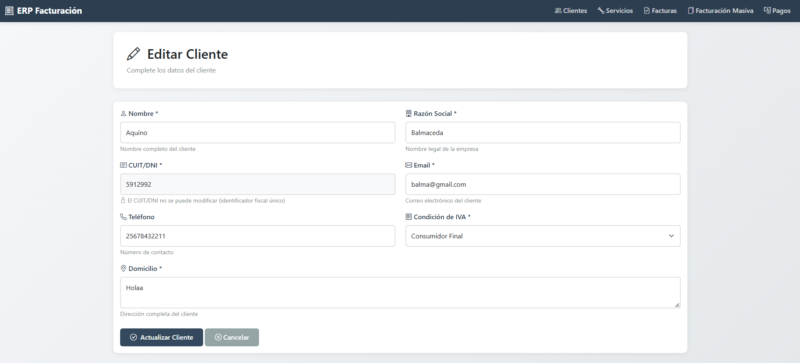

**Caso de Uso: Modificación de Cliente (HU-02)**

| Elemento | Descripción |
|----------|-------------|
| **Actor** | Administrador |
| **Precondición** | El cliente existe en el sistema con un ID válido |
| **Flujo Principal** | 1. El administrador accede al detalle del cliente 2. El administrador hace clic en "Editar" 3. El sistema muestra el formulario de edición prellenado con los datos actuales 4. El sistema muestra el campo CUIT/DNI en modo solo lectura (no modificable) 5. El administrador modifica los campos editables: nombre, razón social, domicilio, email, teléfono, condición IVA 6. El administrador hace clic en "Actualizar Cliente" 7. El sistema valida los datos ingresados (Bean Validation) 8. El sistema ejecuta `CuentaCliente.actualizarDatos()` con las validaciones de negocio 9. El sistema persiste los cambios en la base de datos 10. El sistema muestra mensaje de éxito "Cliente actualizado exitosamente" 11. El sistema redirige al detalle del cliente |
| **Flujos Alternativos** | **7a.** Si hay errores de validación (campo vacío, formato inválido): &nbsp;&nbsp;1. El sistema muestra los errores debajo de cada campo afectado &nbsp;&nbsp;2. El formulario conserva los datos ingresados &nbsp;&nbsp;3. Vuelve al paso 5  **7b.** Si el email tiene formato inválido: &nbsp;&nbsp;1. El sistema muestra error "El formato del email no es válido" &nbsp;&nbsp;2. Marca el campo con borde rojo mediante validación JavaScript &nbsp;&nbsp;3. Vuelve al paso 5 |
| **Postcondición** | Los datos del cliente quedan actualizados en el sistema El CUIT/DNI permanece sin cambios (campo inmutable) |

---

### Wireframe: Gestión de Estado de Cuenta (HU-03)

**Vista: detalle.html (sección cambiar estado)**

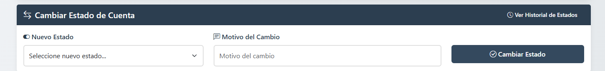

**Vista: historial-estados.html**

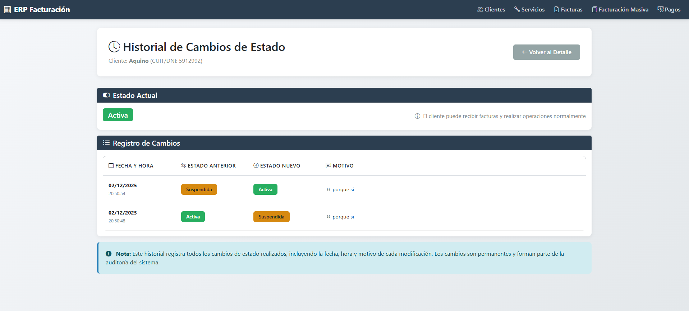

**Caso de Uso: Cambiar Estado de Cuenta (HU-03)**

| Elemento | Descripción |
|----------|-------------|
| **Actor** | Administrador |
| **Precondición** | El cliente existe en el sistema |
| **Flujo Principal** | 1. El administrador accede al detalle del cliente 2. El sistema muestra la tarjeta "Cambiar Estado de Cuenta" con el formulario 3. El sistema muestra el estado actual de la cuenta con badge de color (ACTIVA=verde, SUSPENDIDA=amarillo, BAJA=rojo) 4. El administrador selecciona un nuevo estado del desplegable (ACTIVA, SUSPENDIDA, BAJA) 5. El administrador ingresa el motivo del cambio (campo de texto obligatorio) 6. El administrador hace clic en "Cambiar Estado" 7. El sistema muestra confirmación JavaScript "¿Confirmar cambio de estado?" 8. El administrador confirma 9. El sistema valida que el motivo tenga entre 5 y 500 caracteres 10. El sistema ejecuta `CuentaCliente.cambiarEstado()` que: &nbsp;&nbsp;- Valida que el nuevo estado sea diferente al actual &nbsp;&nbsp;- Crea un registro `CambioEstadoCuenta` con estado anterior, nuevo, motivo y fecha/hora &nbsp;&nbsp;- Agrega el cambio al historial del cliente &nbsp;&nbsp;- Actualiza el estado actual 11. El sistema persiste el cambio con `@Transactional` 12. El sistema muestra mensaje de éxito "Estado cambiado exitosamente a [Estado]" 13. El sistema recarga el detalle del cliente mostrando el nuevo estado |
| **Flujos Alternativos** | **9a.** Si el motivo tiene menos de 5 caracteres: &nbsp;&nbsp;1. El sistema lanza `IllegalArgumentException` con mensaje "El motivo debe tener al menos 5 caracteres" &nbsp;&nbsp;2. Muestra mensaje de error flash &nbsp;&nbsp;3. Vuelve al paso 5  **9b.** Si el motivo supera 500 caracteres: &nbsp;&nbsp;1. El sistema muestra error "El motivo no debe superar los 500 caracteres" &nbsp;&nbsp;2. Vuelve al paso 5  **10a.** Si el nuevo estado es igual al actual: &nbsp;&nbsp;1. El sistema lanza `IllegalArgumentException` con mensaje "El estado de la cuenta ya es [Estado]. No es necesario realizar el cambio." &nbsp;&nbsp;2. Muestra mensaje de error flash &nbsp;&nbsp;3. Redirige al detalle sin cambios |
| **Postcondición** | El estado de la cuenta queda actualizado Se genera un registro en el historial de cambios con trazabilidad completa (fecha/hora, estado anterior, nuevo estado, motivo) |

**Caso de Uso: Ver Historial de Cambios de Estado (HU-03)**

| Elemento | Descripción |
|----------|-------------|
| **Actor** | Administrador |
| **Precondición** | El cliente existe en el sistema |
| **Flujo Principal** | 1. El administrador accede al detalle del cliente 2. El administrador hace clic en "Ver Historial de Estados" 3. El sistema muestra la vista `historial-estados.html` con: &nbsp;&nbsp;- Información del cliente en el encabezado &nbsp;&nbsp;- Tarjeta con estado actual y descripción de lo que significa &nbsp;&nbsp;- Tabla completa de cambios de estado ordenados cronológicamente 4. Para cada cambio se visualiza: &nbsp;&nbsp;- Fecha y hora exacta del cambio &nbsp;&nbsp;- Estado anterior (badge con color, o "Estado inicial" si es null) &nbsp;&nbsp;- Estado nuevo (badge con color) &nbsp;&nbsp;- Motivo completo del cambio 5. El sistema muestra nota informativa sobre auditoría y permanencia de registros 6. El administrador puede volver al detalle del cliente |
| **Flujos Alternativos** | **3a.** Si no hay cambios de estado registrados: &nbsp;&nbsp;1. El sistema muestra mensaje "No hay cambios de estado registrados" &nbsp;&nbsp;2. Indica que la cuenta está en su estado inicial &nbsp;&nbsp;3. Muestra ícono de bandeja vacía |
| **Postcondición** | El administrador visualiza el historial completo sin modificar datos Se mantiene la trazabilidad de auditoría |

---

### Wireframe: Desvincular Servicio de un Cliente (HU-22)

**Vista: confirmar-desvincular.html**

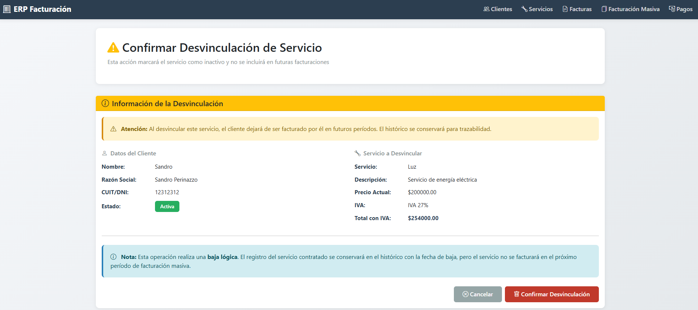

**Vista: historico-servicios.html (con servicios activos e inactivos)**

**Vista: detalle.html (tabla de servicios con botón Quitar)**

**Caso de Uso: Desvincular Servicio de un Cliente (HU-22)**

| Elemento | Descripción |
|----------|-------------|
| **Actor** | Administrador |
| **Precondición** | El cliente existe en el sistema El servicio está contratado activamente por el cliente |
| **Flujo Principal** | 1. El administrador accede al detalle del cliente 2. El sistema muestra la tabla de "Servicios Contratados Activos" 3. El administrador identifica el servicio a desvincular en la lista 4. El administrador hace clic en el botón "Quitar" del servicio deseado 5. El sistema redirige a la vista de confirmación `confirmar-desvincular.html` 6. El sistema muestra: &nbsp;&nbsp;- Alerta de advertencia sobre la operación &nbsp;&nbsp;- Datos completos del cliente (nombre, razón social, CUIT/DNI, estado) &nbsp;&nbsp;- Información del servicio a desvincular (nombre, descripción, precio, IVA, total) &nbsp;&nbsp;- Nota informativa sobre baja lógica y conservación del histórico &nbsp;&nbsp;- Lista de consecuencias de la desvinculación 7. El administrador hace clic en "Confirmar Desvinculación" 8. El sistema ejecuta `CuentaCliente.desvincularServicio(servicio)` 9. El método busca el `ServicioContratado` activo correspondiente 10. El sistema ejecuta `ServicioContratado.desvincular()` que: &nbsp;&nbsp;- Establece `activo = false` &nbsp;&nbsp;- Establece `fechaBaja = LocalDate.now()` 11. El sistema persiste los cambios con `@Transactional` 12. El sistema muestra mensaje flash "Servicio desvinculado exitosamente" 13. El sistema redirige al detalle del cliente 14. El servicio ya no aparece en la lista de servicios activos |
| **Flujos Alternativos** | **9a.** Si el servicio no está contratado activamente: &nbsp;&nbsp;1. El sistema lanza `IllegalArgumentException` con mensaje "El servicio '[Nombre]' no está contratado activamente" &nbsp;&nbsp;2. Muestra mensaje de error flash &nbsp;&nbsp;3. Redirige al detalle del cliente  **7a.** Si el administrador cancela la operación: &nbsp;&nbsp;1. El administrador hace clic en "Cancelar" &nbsp;&nbsp;2. El sistema redirige al detalle del cliente sin realizar cambios |
| **Postcondición** | El servicio queda marcado como inactivo (`activo=false`) Se registra la fecha de baja automáticamente El servicio NO se incluirá en futuras facturaciones masivas El histórico del servicio se conserva en la base de datos El servicio es visible en "Ver Histórico de Servicios" con estado "Inactivo" |

**Caso de Uso: Ver Histórico Completo de Servicios (HU-22)**

| Elemento | Descripción |
|----------|-------------|
| **Actor** | Administrador |
| **Precondición** | El cliente existe en el sistema |
| **Flujo Principal** | 1. El administrador accede al detalle del cliente 2. El administrador hace clic en "Ver Histórico" (desde la tarjeta de servicios) 3. El sistema muestra la vista `historico-servicios.html` con: &nbsp;&nbsp;- Información del cliente en el encabezado &nbsp;&nbsp;- Tabla completa con TODOS los servicios (activos e inactivos) 4. Para cada servicio se visualiza: &nbsp;&nbsp;- Nombre y descripción del servicio &nbsp;&nbsp;- Fecha de alta (siempre visible) &nbsp;&nbsp;- Fecha de baja (visible solo si el servicio fue desvinculado, sino guion "-") &nbsp;&nbsp;- Precio contratado histórico &nbsp;&nbsp;- Alícuota IVA &nbsp;&nbsp;- Total con IVA calculado &nbsp;&nbsp;- Estado (badge verde "Activo" o gris "Inactivo") 5. El sistema muestra tarjeta de resumen con: &nbsp;&nbsp;- Contador de servicios activos (con ícono verde) &nbsp;&nbsp;- Contador de servicios inactivos (con ícono gris) &nbsp;&nbsp;- Total de servicios contratados históricos 6. El administrador puede volver al detalle del cliente |
| **Flujos Alternativos** | **3a.** Si el cliente no tiene servicios contratados: &nbsp;&nbsp;1. El sistema muestra mensaje "No hay servicios contratados" &nbsp;&nbsp;2. Muestra ícono de bandeja vacía &nbsp;&nbsp;3. Muestra botón "Asignar Primer Servicio" |
| **Postcondición** | El administrador visualiza el histórico completo de servicios con trazabilidad Se mantiene la información de precios históricos y fechas de alta/baja |

---

### Wireframe: Anulación de Factura Individual (HU-05)

**Vista: confirmar-anulacion.html**

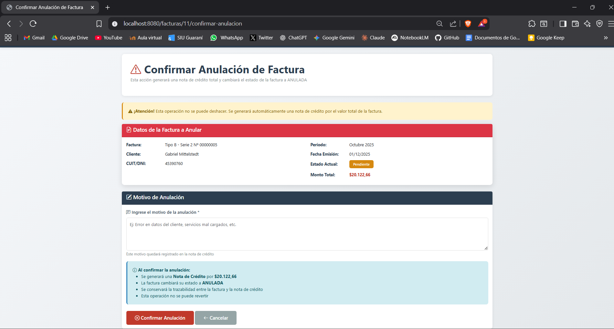

**Vista: detalle.html (con sección de notas de crédito)**

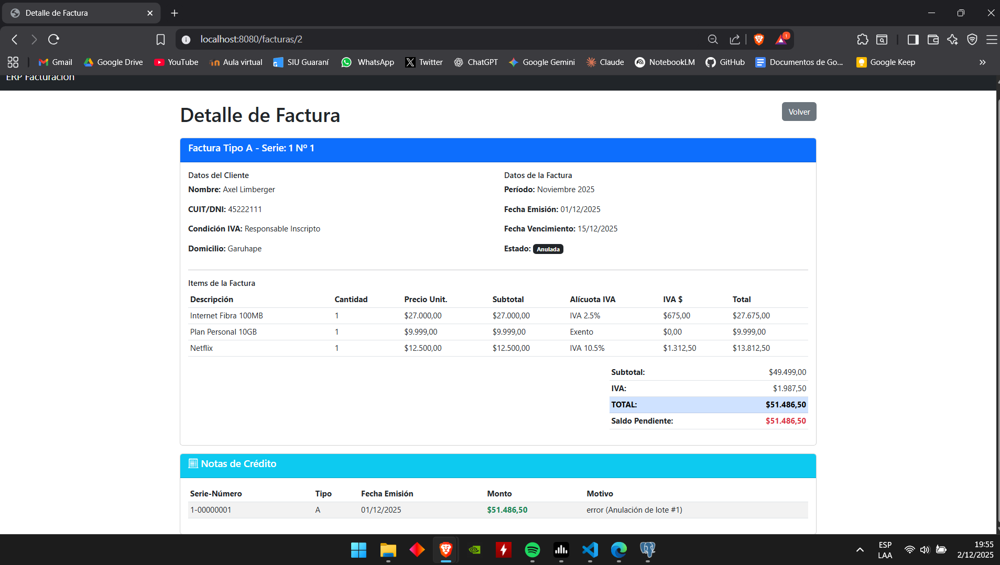

**Caso de Uso: Anulación de Factura Individual (HU-05)**

| Elemento | Descripción |
|----------|-------------|
| **Actor** | Administrador |
| **Precondición** | La factura existe en el sistema con estado PENDIENTE o VENCIDA La factura no tiene pagos registrados |
| **Flujo Principal** | 1. El administrador accede al detalle de la factura 2. El sistema muestra el botón "Anular Factura" (solo si estado=PENDIENTE o VENCIDA) 3. El administrador hace clic en "Anular Factura" 4. El sistema muestra la vista de confirmación con: &nbsp;&nbsp;- Datos completos de la factura a anular &nbsp;&nbsp;- Alerta de advertencia (operación irreversible) &nbsp;&nbsp;- Campo obligatorio: motivo de anulación (textarea, máx. 500 caracteres) &nbsp;&nbsp;- Detalle de lo que ocurrirá: generación de nota de crédito, cambio de estado 5. El administrador ingresa el motivo de anulación 6. El administrador hace clic en "Confirmar Anulación" 7. El sistema valida que el motivo no esté vacío 8. El sistema ejecuta `Factura.puedeSerAnulada()` para verificar reglas de negocio 9. El sistema crea una `NotaCredito` con: &nbsp;&nbsp;- Serie igual a la factura &nbsp;&nbsp;- Número correlativo (obtiene último + 1 de esa serie) &nbsp;&nbsp;- Tipo igual a la factura &nbsp;&nbsp;- Monto igual al total de la factura &nbsp;&nbsp;- Motivo ingresado por el usuario &nbsp;&nbsp;- Fecha emisión actual 10. El sistema ejecuta `Factura.anular()` que cambia estado a ANULADA 11. El sistema persiste la nota de crédito y actualiza la factura 12. El sistema muestra mensaje flash de éxito "Factura anulada exitosamente" 13. El sistema redirige al detalle de la factura donde se visualiza: &nbsp;&nbsp;- Estado ANULADA (badge gris) &nbsp;&nbsp;- Tabla de notas de crédito asociadas |
| **Flujos Alternativos** | **7a.** Si el motivo está vacío: &nbsp;&nbsp;1. El sistema muestra error de validación HTML5 "Por favor, rellene este campo" &nbsp;&nbsp;2. Vuelve al paso 5  **8a.** Si la factura no puede ser anulada (tiene pagos, estado inválido): &nbsp;&nbsp;1. El sistema lanza `IllegalStateException` con mensaje descriptivo &nbsp;&nbsp;2. El sistema muestra mensaje de error flash &nbsp;&nbsp;3. Redirige al detalle de la factura  **9a.** Si falla la generación del número de nota de crédito: &nbsp;&nbsp;1. El sistema rollback de la transacción &nbsp;&nbsp;2. Muestra error técnico &nbsp;&nbsp;3. Vuelve al paso 4 |
| **Postcondición** | Se genera una nota de crédito con numeración automática La factura cambia su estado a ANULADA Se mantiene la trazabilidad (relación bidireccional Factura-NotaCredito) La operación queda registrada con motivo |

---

### Wireframe: Facturación Proporcional Individual (HU-20)

**Vista: formulario-proporcional.html**

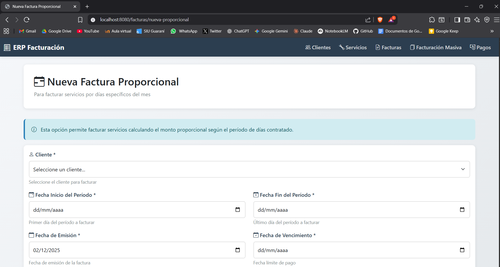

**Vista: lista.html (con botón "Factura Proporcional")**

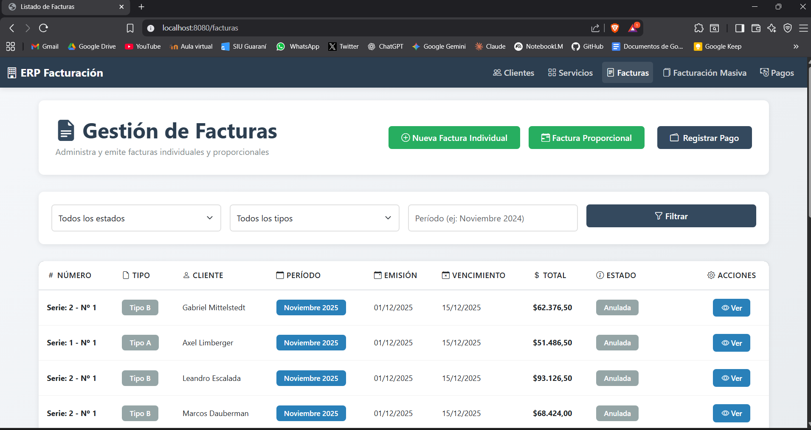

**Caso de Uso: Facturación Proporcional por Fecha de Alta (HU-20)**

| Elemento | Descripción |
|----------|-------------|
| **Actor** | Administrador |
| **Precondición** | El cliente existe en el sistema con estado ACTIVA El cliente tiene servicios contratados activos El emisor tiene condición IVA Responsable Inscripto |
| **Flujo Principal** | 1. El administrador accede a "Gestión de Facturas" 2. El administrador hace clic en "Factura Proporcional" 3. El sistema muestra el formulario con campos: &nbsp;&nbsp;- Cliente (select con clientes activos) &nbsp;&nbsp;- Fecha inicio del período (date input) &nbsp;&nbsp;- Fecha fin del período (date input) &nbsp;&nbsp;- Fecha de emisión (date input, por defecto fecha actual) &nbsp;&nbsp;- Fecha de vencimiento (date input) &nbsp;&nbsp;- Porcentaje de descuento (number, opcional, 0-100%) &nbsp;&nbsp;- Motivo del descuento (text, obligatorio si hay descuento) 4. El administrador selecciona el cliente 5. El administrador ingresa las fechas del período (inicio y fin) 6. El administrador ingresa fecha de emisión y vencimiento 7. El administrador opcionalmente ingresa descuento y motivo 8. El sistema valida en tiempo real (JavaScript): &nbsp;&nbsp;- Fin período > inicio período &nbsp;&nbsp;- Vencimiento > emisión &nbsp;&nbsp;- Si descuento > 0, motivo obligatorio 9. El administrador hace clic en "Generar Factura Proporcional" 10. El sistema ejecuta validaciones backend (`Factura.validarFechas()`) 11. El sistema crea un `PeriodoFacturacion` (Value Object) que: &nbsp;&nbsp;- Calcula días efectivos del período &nbsp;&nbsp;- Calcula días totales del mes &nbsp;&nbsp;- Genera descripción en español: "del DD al DD de MMMM YYYY (X días)" 12. El sistema obtiene servicios contratados activos del cliente 13. Para cada servicio, el sistema invoca `ItemFactura.crearProporcional()`: &nbsp;&nbsp;- Calcula precio proporcional: (días_efectivos / días_mes) × precio_mensual &nbsp;&nbsp;- Genera descripción automática con el período &nbsp;&nbsp;- Copia alícuota IVA del servicio &nbsp;&nbsp;- Establece cantidad = 1 14. El sistema determina tipo de factura según reglas AFIP 15. El sistema asigna serie y obtiene número correlativo 16. El sistema calcula totales (subtotal, IVA, descuento, total) 17. El sistema persiste la factura con estado PENDIENTE 18. El sistema muestra mensaje de éxito con datos de la factura 19. El sistema redirige al detalle de la factura creada |
| **Flujos Alternativos** | **8a.** Si fin período ≤ inicio período: &nbsp;&nbsp;1. El sistema muestra error de validación HTML5 "La fecha fin debe ser posterior a la fecha inicio" &nbsp;&nbsp;2. Marca el campo con borde rojo &nbsp;&nbsp;3. Vuelve al paso 5  **8b.** Si vencimiento ≤ emisión: &nbsp;&nbsp;1. El sistema muestra error "La fecha de vencimiento debe ser posterior a la emisión" &nbsp;&nbsp;2. Vuelve al paso 6  **8c.** Si hay descuento sin motivo: &nbsp;&nbsp;1. El sistema muestra error "Debe especificar el motivo del descuento" &nbsp;&nbsp;2. Vuelve al paso 7  **12a.** Si el cliente no tiene servicios contratados activos: &nbsp;&nbsp;1. El sistema muestra error "El cliente no tiene servicios activos para facturar" &nbsp;&nbsp;2. Redirige al formulario manteniendo datos ingresados &nbsp;&nbsp;3. Vuelve al paso 4  **11a.** Si el período abarca múltiples meses: &nbsp;&nbsp;1. El sistema lanza `IllegalArgumentException` &nbsp;&nbsp;2. Muestra error "El período debe estar dentro del mismo mes" &nbsp;&nbsp;3. Vuelve al paso 5 |
| **Postcondición** | Se crea una factura con ítems proporcionales calculados automáticamente Cada ítem tiene descripción detallada del período y días facturados Los precios reflejan el cálculo proporcional exacto La factura queda con estado PENDIENTE y saldo igual al total |

### Wireframe: Gestión de Saldo a Favor (HU-13)

**Vista: Detalle del Cliente (mostrando saldo a favor)**

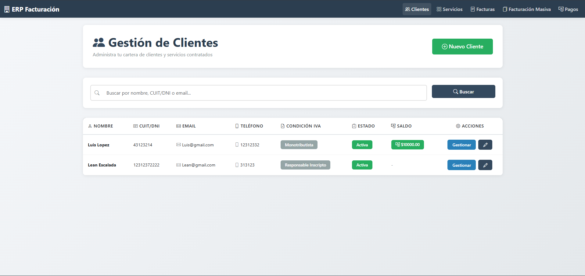

La visualización del saldo a favor se integra en la vista de gestion del cliente donde se muestra en la tabla el monto disponible cuando el cliente tiene crédito a favor.

**Vista: Selección de Facturas para Aplicar Saldo**

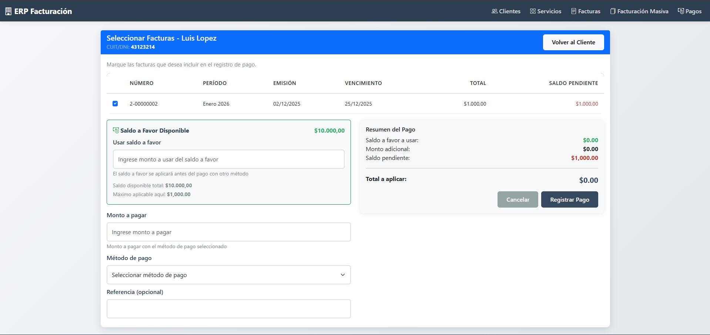

En la vista de pago combinado (`pagos/seleccionar-facturas.html`), se incluye un campo para ingresar el monto de saldo a favor a aplicar, con validaciones que previenen el uso de más saldo del disponible.

**Vista: Recibo con Saldo a Favor Aplicado**

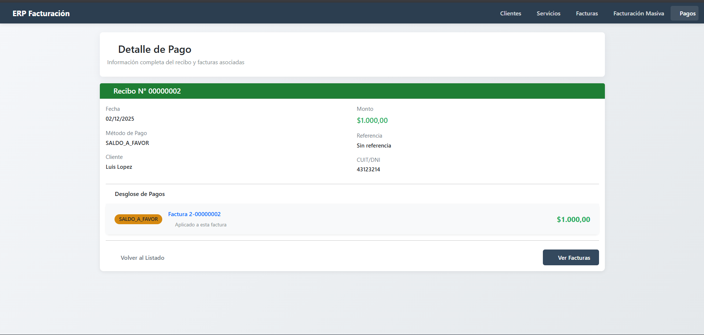

El recibo (`pagos/recibo-detalle.html`) muestra claramente cuándo se utilizó saldo a favor como método de pago.

---

### Wireframe: Registrar Pago Combinado - Múltiples Facturas (HU-14)

**Vista: Selección de Facturas y Registro de Pago**

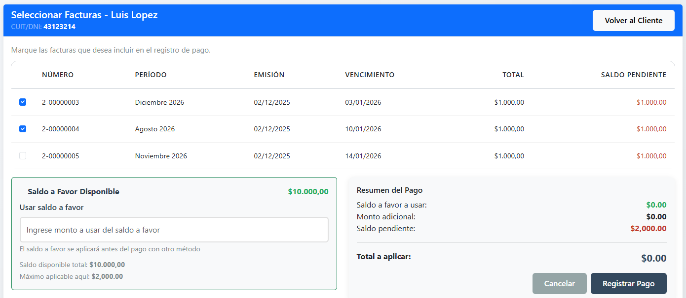

La funcionalidad de pago combinado se implementa en la vista `pagos/seleccionar-facturas.html`, que permite al administrador:
- Ver todas las facturas impagas del cliente en una tabla interactiva
- Seleccionar múltiples facturas mediante checkboxes
- Opcionalmente aplicar saldo a favor disponible
- Ingresar un monto adicional con método de pago (efectivo, transferencia, tarjeta)

**Vista: Detalle del Recibo Consolidado**

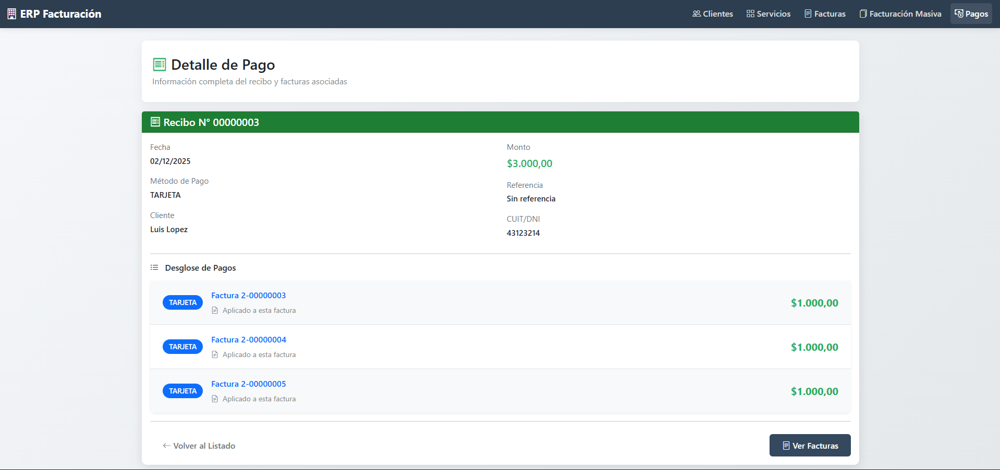

El recibo en `pagos/recibo-detalle.html` muestra claramente:
- Todas las facturas afectadas por el pago combinado
- Los métodos de pago utilizados (puede combinar saldo a favor + otro método)
- El detalle de distribución del monto entre las facturas

---

### Wireframe: Consulta de Pagos y Recibos (HU-15)

**Vista: Listado de Pagos y Recibos**

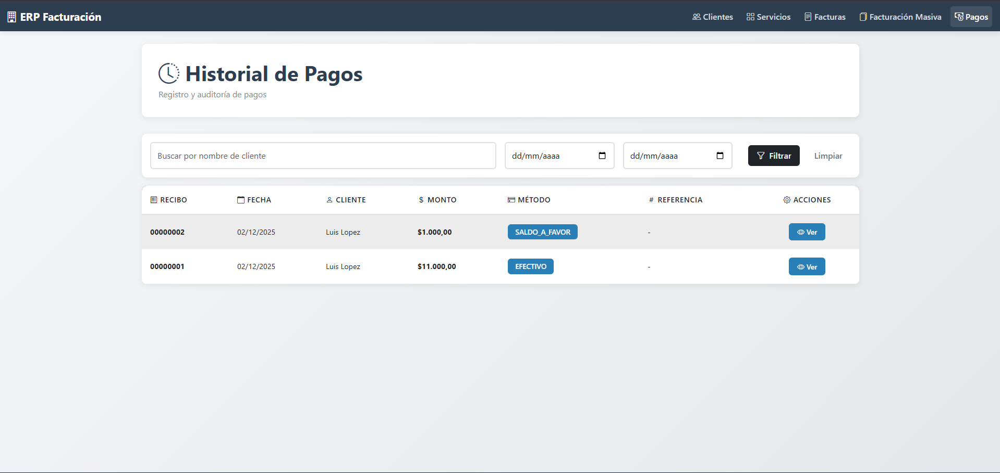

La vista `pagos/lista.html` muestra un historial completo de todos los pagos registrados, presentados como recibos consolidados.

Características principales:
- **Filtros de búsqueda:** Permite filtrar por nombre de cliente y rango de fechas (desde/hasta)
- **Tabla responsive:** Muestra número de recibo, fecha, cliente, monto, método de pago y referencia
- **Agrupación inteligente:** Pagos combinados aparecen como un solo recibo con método "Combinado"
- **Botón "Ver":** Accede al detalle completo del recibo

**Vista: Detalle del Recibo**

La vista `pagos/recibo-detalle.html` muestra la información completa de un recibo, incluyendo:
- **Encabezado:** Número de recibo, fecha, cliente (nombre y CUIT/DNI)
- **Información del pago:** Monto total, método(s) de pago, referencia
- **Desglose de pagos:** Tabla detallada mostrando:
  - Enlace a cada factura afectada (cuando aplica)
  - Monto aplicado a cada factura
- **Navegación:** Botones para volver al listado o ir a facturas

---

### Wireframe: Modificación de Servicio (HU-18)

**Vista: lista.html**
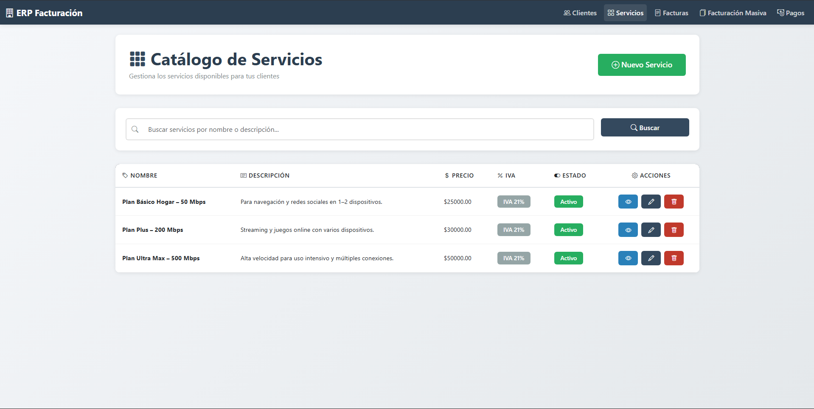
**Vista: formulario.html (modo edición)**

El formulario reutiliza la misma vista que el alta de servicio, cambiando dinámicamente:
- Título: "Editar Servicio" en lugar de "Crear Servicio"
- Botón: "Actualizar Servicio" en lugar de "Crear Servicio"
- Campos prellenados con los datos actuales del servicio

**Caso de Uso: Modificación de Servicio (HU-18)**

| Elemento | Descripción |
|----------|-------------|
| **Actor** | Administrador |
| **Precondición** | El servicio ya existe en el sistema |
| **Flujo Principal** | 1. El administrador accede al detalle del servicio 2. El administrador hace clic en "Editar" 3. El sistema muestra el formulario de edición prellenado con los datos actuales 4. El administrador modifica los campos editables: nombre, descripción, precio, alícuota IVA 5. El administrador hace clic en "Actualizar Servicio" 6. El sistema valida los datos ingresados 7. El sistema verifica que el nuevo nombre no esté en uso por otro servicio 8. El sistema ejecuta `Servicio.modificar()` con los nuevos datos 9. El sistema actualiza los datos del servicio 10. El sistema persiste los cambios en la base de datos 11. El sistema muestra mensaje de éxito "Servicio modificado exitosamente" 12. El sistema redirige al detalle del servicio |
| **Flujos Alternativos** | **6a.** Si hay errores de validación (nombre vacío, precio inválido): &nbsp;&nbsp;1. El sistema muestra los errores en mensaje flash &nbsp;&nbsp;2. Redirige al formulario de edición &nbsp;&nbsp;3. Vuelve al paso 4  **7a.** Si el nombre ya existe en otro servicio: &nbsp;&nbsp;1. El sistema muestra el mensaje "Ya existe otro servicio con el nombre: [nombre]" &nbsp;&nbsp;2. Muestra mensaje de error flash &nbsp;&nbsp;3. Redirige al formulario de edición &nbsp;&nbsp;4. Vuelve al paso 4 |
| **Postcondición** | Los datos del servicio quedan actualizados en el sistema Los contratos activos tienen el nuevo precio Las facturas ya emitidas conservan el precio original |

---

### Wireframe: Baja de Servicio (HU-19)

**Vista: confirmar-eliminar.html**
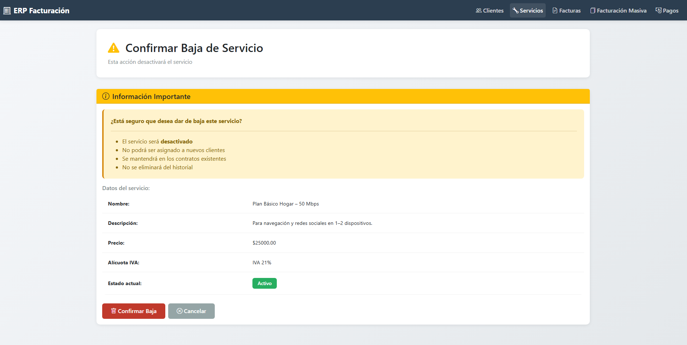
La vista muestra:
- Información del servicio a dar de baja (nombre, descripción, precio, IVA)
- Alerta de advertencia sobre las consecuencias
- Botón "Confirmar Baja" y "Cancelar"

**Vista: lista.html (con estado del servicio)**

La lista de servicios muestra:
- Badge verde "Activo" para servicios disponibles
- Badge rojo "Inactivo" para servicios dados de baja
- Botón "Reactivar" visible solo para servicios inactivos

**Caso de Uso: Baja de Servicio (HU-19)**

| Elemento | Descripción |
|----------|-------------|
| **Actor** | Administrador |
| **Precondición** | El servicio existe en el sistema con estado activo |
| **Flujo Principal** | 1. El administrador accede al detalle del servicio 2. El administrador hace clic en "Dar de Baja" 3. El sistema muestra la vista de confirmación con: &nbsp;&nbsp;- Datos completos del servicio &nbsp;&nbsp;- Alerta de advertencia sobre las consecuencias &nbsp;&nbsp;- Lista de impactos: no disponible para nuevas contrataciones, excluido de facturación 4. El administrador hace clic en "Confirmar Baja" 5. El sistema cambia el estado del servicio a "Inactivo" 6. El sistema persiste los cambios  7. El sistema muestra mensaje de éxito "Servicio dado de baja exitosamente" 8. El sistema redirige al listado de servicios |
| **Flujos Alternativos** | **4a.** Si el administrador cancela la operación: &nbsp;&nbsp;1. El administrador hace clic en "Cancelar" &nbsp;&nbsp;2. El sistema redirige al detalle del servicio sin realizar cambios |
| **Postcondición** | El servicio queda marcado como inactivo El servicio NO se incluirá en facturación masiva ni individual El servicio NO estará disponible para nuevas contrataciones Los contratos existentes conservan el servicio en su histórico |

---

## Backlog de Iteración 2
* **HU-02:** Modificación de cliente (Responsable: Axel Dos Santos)
* **HU-03:** Gestión de estado de cuenta (Responsable: Axel Dos Santos)
* **HU-05:** Anulación de factura individual (Responsable: Gabriel Mittelstedt)
* **HU-08:** Anulación de facturación masiva (Responsable: Marcos Doubermann)
* **HU-09:** Consulta de facturación masiva (Responsable: Marcos Doubermann)
* **HU-13:** Gestión de saldo a favor (Responsable: Axel Limberger)
* **HU-14:** Registrar pago combinado (múltiples facturas) (Responsable: Axel Limberger)
* **HU-15:** Consulta de pagos y recibos (Responsable: Axel Limberger)
* **HU-18:** Modificación de servicio (Responsable: Leandro Escalada)
* **HU-19:** Baja de servicio (Responsable: Leandro Escalada)
* **HU-20:** Facturación proporcional por fecha de alta (Responsable: Gabriel Mittelstedt)
* **HU-22:** Desvincular servicio de un cliente (Responsable: Axel Dos Santos)

## Tareas

### HU-02: Modificación de Cliente (Axel Dos Santos)

**Modelo**
- [x] Crear método `actualizarDatos()` en `CuentaCliente` con validaciones de negocio
- [x] Validar que campos obligatorios no estén vacíos o nulos
- [x] Implementar lógica de trimming para campos de texto

**Repositorio**
- [x] Verificar que `CuentaClienteRepository` tiene método `findByCuitDni()` existente
- [x] Validar que no se necesitan nuevas consultas personalizadas

**Servicio**
- [x] Crear método `actualizarCliente()` en `CuentaClienteService`
- [x] Implementar lógica de búsqueda de cliente por ID
- [x] Validar que el cliente exista antes de actualizar
- [x] Invocar método de dominio `actualizarDatos()`
- [x] Manejar excepciones y convertir a mensajes de error amigables

**Controlador**
- [x] Crear endpoint GET `/clientes/{id}/editar` para mostrar formulario
- [x] Prellenar formulario con datos actuales del cliente
- [x] Crear endpoint POST `/clientes/{id}/editar` para procesar actualización
- [x] Validar datos con `@Valid` y `BindingResult`
- [x] Manejar errores de validación y mostrar en vista

**Vista**
- [x] Modificar `formulario.html` para soportar modo edición (`esEdicion=true`)
- [x] Cambiar título dinámicamente: "Nuevo Cliente" vs "Editar Cliente"
- [x] Mostrar mensaje informativo: "El CUIT/DNI no se puede modificar"
- [x] Excluir campo "Estado" del formulario de edición (se gestiona aparte)

**Pruebas**
- [x] Probar actualización exitosa de todos los campos editables
- [x] Verificar que CUIT/DNI permanece inmutable
- [x] Validar manejo de errores de validación Bean Validation

---

### HU-03: Gestión de Estado de Cuenta (Axel Dos Santos)

**Modelo**
- [x] Crear entidad `CambioEstadoCuenta` con anotaciones JPA
- [x] Definir campos: id, cliente, estadoAnterior, estadoNuevo, fechaCambio, motivo
- [x] Configurar relación `@ManyToOne` con `CuentaCliente`
- [x] Implementar `@PrePersist` para establecer `fechaCambio` automáticamente
- [x] Agregar validaciones Bean Validation (NotNull, NotBlank, Size)
- [x] Crear método `cambiarEstado()` en `CuentaCliente` con lógica de negocio

**Repositorio**
- [x] Crear `CambioEstadoCuentaRepository` extendiendo `JpaRepository`
- [x] Agregar Query Method `findByClienteOrderByFechaCambioDesc(CuentaCliente cliente)`

**Servicio**
- [x] Crear método `cambiarEstadoCuenta()` en `CuentaClienteService`
- [x] Buscar cliente por ID y validar existencia
- [x] Manejar `IllegalArgumentException` y mostrar mensaje de error
- [x] Ordenar historial por fecha descendente

**Controlador**
- [x] Crear endpoint POST `/clientes/{id}/cambiar-estado` en `CuentaClienteViewController`
- [x] Manejar excepciones y mostrar mensajes flash de error o éxito
- [x] Crear endpoint GET `/clientes/{id}/estados/historico`
- [x] Cargar cliente y su historial de cambios
- [x] Retornar vista `historial-estados.html`

**Vistas**
- [x] Agregar tarjeta "Cambiar Estado de Cuenta" en `detalle.html`
- [x] Crear formulario con campos: nuevo estado (select) y motivo (input text)
- [x] Agregar botón "Ver Historial de Estados" que enlaza a historial
- [x] Crear vista `historial-estados.html` completa
- [x] Mostrar información del cliente en encabezado
- [x] Crear tarjeta con estado actual y descripción
- [x] Crear tabla de historial con columnas: fecha/hora, estado anterior, estado nuevo, motivo

**Pruebas**
- [x] Probar cambio de estado exitoso con motivo válido
- [x] Verificar creación de registro en historial con fecha automática
- [x] Validar error al intentar cambiar al mismo estado
- [x] Comprobar visualización correcta del historial ordenado
- [x] Verificar trazabilidad completa de cambios

---

### HU-22: Desvincular Servicio de un Cliente (Axel Dos Santos)

**Modelo**
- [x] Crear método `desvincularServicio()` en `CuentaCliente`
- [x] Crear método `desvincular()` en `ServicioContratado`

**Repositorio**
- [x] Verificar que `ServicioContratadoRepository` existe y es funcional

**Servicio**
- [x] Crear método `desvincularServicio()` en `CuentaClienteService`
- [x] Manejar excepciones y convertir a mensajes amigables

**Controlador**
- [x] Crear endpoint GET `/clientes/{clienteId}/servicios/{servicioId}/desvincular`
- [x] Retornar vista de confirmación `confirmar-desvincular.html`
- [x] Crear endpoint POST `/clientes/{clienteId}/servicios/{servicioId}/desvincular`
- [x] Redirigir al detalle del cliente tras éxito

**Vistas**
- [x] Crear vista `confirmar-desvincular.html` completa
- [x] Crear sección con datos del cliente (nombre, razón social, CUIT, estado)
- [x] Crear sección con información del servicio (nombre, descripción, precio, IVA, total)
- [x] Crear formulario POST con botón de confirmación (rojo, ícono de eliminar)
- [x] Modificar `detalle.html` para agregar botón "Quitar" en tabla de servicios
- [x] Actualizar `historico-servicios.html` para mostrar servicios activos e inactivos

**Pruebas**
- [x] Probar desvinculación exitosa de servicio activo
- [x] Verificar que servicio desvinculado tiene `activo=false` y `fechaBaja` establecida
- [x] Validar error al intentar desvincular servicio no contratado
- [x] Validar error al intentar desvincular servicio ya inactivo
- [x] Comprobar que servicio desvinculado no aparece en lista de activos
- [x] Verificar que servicio desvinculado aparece en histórico con estado "Inactivo"
- [x] Validar conservación de datos históricos (fecha alta, precio contratado)

---

### HU-18: Modificación de Servicio (Leandro Escalada)

**Modelo**
- [x] Crear método `modificar()` en `Servicio` que recibe nuevos valores y actualiza campos
- [x] Implementar Bean Validation: `@NotBlank`, `@Size(max=100)` para nombre
- [x] Implementar Bean Validation: `@Size(max=500)` para descripción
- [x] Implementar Bean Validation: `@NotNull`, `@DecimalMin("0.01")`, `@Digits(integer=8, fraction=2)` para precio
- [x] Implementar Bean Validation: `@NotNull` para alícuota IVA
- [x] Crear constructores: completo con todos los parámetros y mínimo solo con nombre

**Repositorio**
- [x] Verificar que `ServicioRepository` tiene método `findByNombreIgnoreCase()` existente
- [x] Validar funcionamiento para verificar unicidad del nombre

**Servicio**
- [x] Crear método `modificarServicio()` en `ServicioService`
- [x] Buscar servicio por ID y validar existencia
- [x] Validar que el nuevo nombre no esté en uso por otro servicio (unicidad)
- [x] Invocar método de dominio `modificar()` con los nuevos valores
- [x] Implementar propagación de precio: actualizar `precioContratado` en `ServicioContratado` activos
- [x] Guardar cambios en servicio y contratos afectados

**Controlador**
- [x] Crear endpoint GET `/servicios/{id}/editar` para mostrar formulario en modo edición
- [x] Prellenar formulario con datos actuales del servicio
- [x] Crear endpoint POST `/servicios/{id}/editar` para procesar actualización
- [x] Validar datos con `@Valid` y `BindingResult`
- [x] Manejar excepciones de validación y unicidad con mensajes en `RedirectAttributes`

**Vista**
- [x] Modificar `formulario.html` para soportar modo edición (atributo `servicio.id`)
- [x] Cambiar título dinámicamente según atributo `accion`: "Crear Servicio" vs "Editar Servicio"
- [x] Mostrar errores de validación junto a cada campo
- [x] Agregar botón "Editar" en tabla de `lista.html` que enlaza a `/servicios/{id}/editar`

**Pruebas**
- [x] Probar modificación exitosa de nombre, descripción, precio y alícuota IVA
- [x] Verificar error al intentar usar nombre duplicado
- [x] Validar propagación de precio a contratos activos
- [x] Verificar que facturas históricas conservan `precioUnitario` original
- [x] Probar validaciones Bean Validation (campo vacío, precio negativo, etc.)

---

### HU-19: Baja de Servicio (Leandro Escalada)

**Modelo**
- [x] Agregar atributo `activo` (boolean, default `true`) en `Servicio`
- [x] Crear método `desactivar()` que establece `activo = false`
- [x] Crear método `activar()` que establece `activo = true`
- [x] Crear método `puedeFacturarse()` que retorna `activo` (para filtros de facturación)
- [x] Configurar relación `@OneToMany` con `ServicioContratado` (campo `contratos`)

**Repositorio**
- [x] Verificar que `ServicioRepository` no requiere cambios adicionales

**Servicio**
- [x] Crear método `darDeBajaServicio()` en `ServicioService` que invoca `desactivar()`
- [x] Crear método `reactivarServicio()` en `ServicioService` que invoca `activar()`
- [x] Ambos métodos buscan servicio por ID y validan existencia

**Controlador**
- [x] Crear endpoint GET `/servicios/{id}/confirmar-eliminar` para vista de confirmación
- [x] Crear endpoint POST `/servicios/{id}/eliminar` para ejecutar baja lógica
- [x] Crear endpoint POST `/servicios/{id}/reactivar` para reactivar servicio
- [x] Redirigir a lista de servicios tras éxito con mensaje informativo

**Vista**
- [x] Crear vista `confirmar-eliminar.html` con información del servicio a dar de baja
- [x] Mostrar advertencias sobre impacto (contratos activos, exclusión de facturación)
- [x] Agregar botón "Dar de Baja" (rojo) en `lista.html` para servicios activos
- [x] Agregar botón "Reactivar" (verde) en `lista.html` para servicios inactivos
- [x] Mostrar estado "Activo"/"Inactivo" con badge de color en tabla

**Impacto en Facturación**
- [x] Modificar `FacturaService.generarFacturaMasiva()`: verificar `servicio.puedeFacturarse()` antes de crear ítems
- [x] Los servicios con `activo=false` no generan ítems de factura
- [x] Los contratos asociados a servicios inactivos permanecen en base de datos (histórico)

**Pruebas**
- [x] Probar baja lógica exitosa de servicio activo
- [x] Verificar que servicio dado de baja tiene `activo=false`
- [x] Probar reactivación exitosa de servicio dado de baja
- [x] Validar que servicio inactivo no aparece en facturación masiva
- [x] Verificar que servicio inactivo sigue visible en listado con estado "Inactivo"
- [x] Validar que histórico de servicios contratados muestra servicios dados de baja